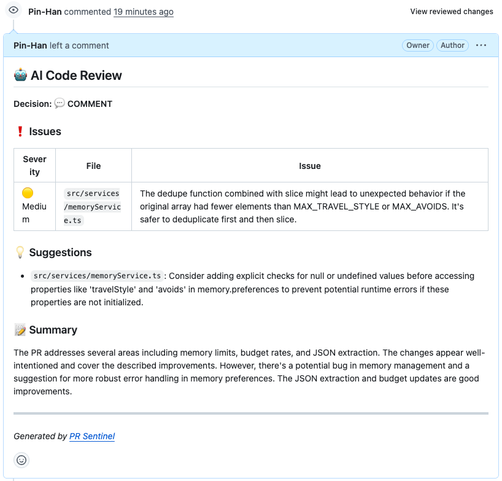

# PR Sentinel

An AI-powered code review agent built with **LangGraph** that automatically reviews GitHub pull requests via webhooks. When a PR is opened, the agent analyzes the diff, evaluates its own review quality, and posts structured feedback directly on the PR.



## Key Features

- **Automatic PR Review** --- Triggered by GitHub webhooks on PR open, reopen, or push
- **Quality Self-Evaluation** --- An evaluator scores the initial analysis (0--10); low scores trigger automatic re-analysis (up to 2 retries)
- **High-Risk Detection** --- Flags PRs containing database migrations, auth changes, or dangerous operations
- **Human-in-the-Loop** --- High-risk PRs pause via LangGraph `interrupt()` and wait for manual approval before posting
- **Deduplication** --- Rapid pushes cancel stale reviews and start fresh for the new HEAD

## Architecture

```
GitHub Webhook (PR opened/reopened/synchronize)
        |
        v
  FastAPI Server (src/main.py)
  - Signature verification
  - Immediate 200 response
  - Background asyncio.create_task
        |
        v
  LangGraph StateGraph (src/agent/graph.py)
  +------------------------------------------------------+
  |                                                      |
  |  fetch_diff --> analyze_code --> evaluate_quality     |
  |                                    |                  |
  |                    +---------------+--------+        |
  |                    |               |        |        |
  |                    v               v        v        |
  |              revise_review   human_chkpt  format     |
  |                    |               |      _review    |
  |                    v               |        |        |
  |              evaluate_quality      |        |        |
  |              (max 2 retries)       v        v        |
  |                            format_review    |        |
  |                                    |        |        |
  |                                    v        v        |
  |                               post_review            |
  +------------------------------------------------------+
        |
        v
  GitHub PR Review Comment
```

## Tech Stack

| Component | Choice | Why |
|-----------|--------|-----|
| **Agent Framework** | LangGraph | Conditional edges, retry cycles, HitL checkpoints |
| **LLM** | Google Gemini 2.5 Flash Lite | Fast, cost-effective, structured output via function calling |
| **Web Server** | FastAPI | Async-native, lightweight webhook receiver |
| **HTTP Client** | httpx | Fully async GitHub API calls |
| **Checkpointer** | SQLite (aiosqlite) | Persistent state for HitL interrupt/resume |
| **Deployment** | Railway | Auto-deploy from GitHub, persistent volume |

## LangGraph Concepts Demonstrated

| Concept | Implementation |
|---------|---------------|
| **StateGraph** | `PRReviewState` TypedDict with typed fields for each pipeline stage |
| **Conditional Edges** | `route_after_evaluate` routes to retry, HitL, or pass-through based on score and risk |
| **Cycles** | `revise_review -> evaluate_quality` loop (max 2 retries) for quality self-improvement |
| **Human-in-the-Loop** | `interrupt()` pauses graph on high-risk PRs; `Command(resume=...)` resumes after approval |
| **Checkpointer** | `AsyncSqliteSaver` persists graph state so interrupted runs survive server restarts |
| **Dependency Injection** | `functools.partial` binds GitHub client and LLM client to node functions |

## API Endpoints

| Method | Path | Description |
|--------|------|-------------|
| `GET` | `/health` | Health check |
| `POST` | `/webhook/github` | GitHub webhook receiver |
| `POST` | `/review/resume` | Resume an interrupted HitL review |
| `GET` | `/review/status/{repo}/{pr}/{sha}` | Check if a review is awaiting approval |

## Project Structure

```
src/
  main.py              # FastAPI app, webhook handler, lifespan, HitL endpoints
  checkpointer.py      # SQLite checkpointer factory with fallback paths
  agent/
    graph.py           # LangGraph StateGraph with conditional edges and cycle
    nodes.py           # Node functions: fetch, analyze, evaluate, revise, checkpoint, format, post
    prompts.py         # Gemini function calling schemas and prompt templates
    router.py          # Conditional routing logic (retry vs HitL vs pass-through)
    state.py           # PRReviewState TypedDict
  github/
    client.py          # Async GitHub API client (httpx)
    diff.py            # Diff processing with token budget and file filtering
    webhook.py         # Webhook signature verification and event parsing
tests/
  test_router.py       # Routing logic unit tests (9 cases)
  test_evaluate.py     # Evaluate and revise node tests with mocked LLM
  test_nodes.py        # Format review tests
  test_diff.py         # Diff processing tests
  test_webhook.py      # Webhook signature and event filtering tests
```

## Setup

```bash
# Clone and install
git clone https://github.com/Pin-Han/pr-sentinel.git
cd pr-sentinel
python -m venv .venv && source .venv/bin/activate
pip install -e ".[dev]"

# Configure environment
cp .env.example .env
# Edit .env with your keys:
#   GOOGLE_API_KEY     - Google AI Studio API key
#   GITHUB_TOKEN       - Fine-grained PAT (pull_requests: rw, issues: rw, contents: r)
#   GITHUB_WEBHOOK_SECRET - Webhook signature secret

# Run locally
uvicorn src.main:app --reload --port 8000

# Run tests
pytest
```

## Known Limitations and Future Improvements

- **Context window** --- Currently only analyzes the diff, not the full file context. This leads to false positives when the LLM cannot see surrounding implementation (e.g., fallback logic in unchanged code).
- **Body-level reviews** --- Feedback is posted as a single review body. Inline comments with `path` + `line` would be more actionable.
- **LLM accuracy** --- The evaluator/retry cycle improves consistency, but review quality depends on the underlying model's code understanding.

## License

MIT
